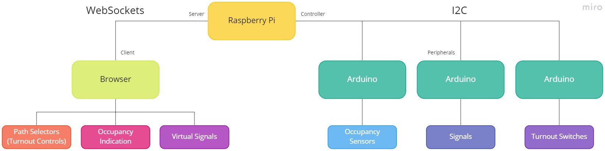
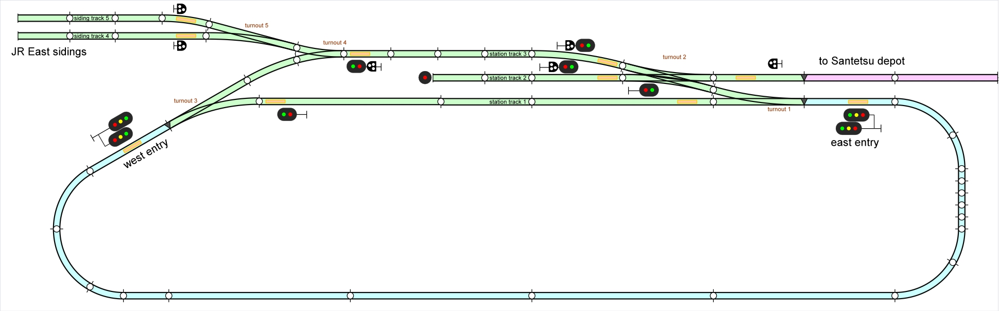

# Kitasanriku Project

> Model railway station dispatcher project

## About

This project aims to provide a complete software and hardware specifications for a dispatcher of a model railway station. The goal of this first phase is to have everything working for one particular station (codename Kitasanriku), in the future it would be nice to have the software part extensible to support more different layouts and scenarios.

## Project Name Background

Kitasanriku (北三陸) is a fictional city featured in the Japanese television drama [Amachan](https://en.wikipedia.org/wiki/Amachan) (あまちゃん). It is a home city of Kitasanriku Railway Company (北三陸鉄道), or Kitatetsu (北鉄) for short. Even though these are fictional names, they are based on their real-life couterparts - the city of [Kuji](https://www.city.kuji.iwate.jp/) (久慈) and the [Sanriku Railway Company](https://www.sanrikutetsudou.com/) (三陸鉄道), or Santetsu (三鉄) for short.

This project shares the Kitasanriku name because my main modelling object is the Sanriku Railway (and nonelectrified east Iwate railways in general), because the first version of the station on my layout has one entry track on each side, but is served by a different company from each side, and also because I enjoyed watching Amachan series a lot and Tomix provides some Amachan-inspired accessories.

## Rationale

In Japan, it is common for railway modellers to run their trains on temporary layouts which are laid on floors or tables. They are assembled for a session lasting few days or even hours and then are disassembled and stored again. That means that the system must be simple to put together, yet sturdy enough to sustain constant dismantling, and must not take a lot of space. Because of that, Japan is the leading country in _N scale_ (9mm gauge) railways. Both largest Japanese companies that produce model railway stuff, [Tomix](https://www.tomytec.co.jp/tomix/) and [Kato](https://www.katomodels.com/), offer a large variation of tracks with incorporated trackbed that are both sturdy and suitable for laying on the floor, together with a lot of accessories that are very easy to connect and use.

To offer this simplicity for temporary layouts, everything is very simple. Both the controllers and most of the trains offer just _analog_ driving (sometimes called DC). The only advanced feature here is _Constant Lighting_ (CL) that is offered by advanced controllers and which provides a possibility to turn on train lights without turning on its motor as well. Accessories usually use colored connectors and slots that can't be mixed so they are not damaged by a wrong connection. There is no DIY at all for most accessories. Even more complex accessories like signals or crossings are self-contained and can't be linked together or to other accessories like turnouts to provide dependencies between them. For example, Tomix signals have a train sensor embedded and the actual aspects shown by the signal are time-based - when a train passes the signal, red is lit for some time, then it switches to other signal(s) after some time. That means that they are not usable as e.g. station entry signals.

Tomix also provides automation accessories ([TNOS](https://www.tomytec.co.jp/tomix/necst/5701tnos/)), but it still is a closed system that you just connect tracks, turnouts, and sensors to, resulting into trains running automatically. It does not provide any possibility for programming and even though it can be used for some use cases this project tries to solve, it is overly expensive and, what is more important, does not provide a challenge 🙂

## Basic Ideas

This project mixes the original accessories with Arduino computers to provide the missing connectivity and dependency. The manufacturer of choice is Tomix – it's range of track pieces and accessories is wide and very usable.

The project does not aim to provide full automation like DCC or TNOS. The train driver controls the train as usual, using analog controller. It is the station dispatcher that this project tries to simulate. They control the station as a whole – setting paths and turnouts, checking track occupancy, changing signal aspects. For the first phase, only one station is considered. That means that accessories controlled by this project is limited to everything between station entry signals (including their distant signals), no occupancy detection is done on tracks outside the station.

## Overall Architecture

The main unit is one Raspberry Pi (of any suitable version). It is the only place where the dispatching logic happens and is also the only place that holds the whole current status of the station.

Accessories are connected to Arduino boards which are connected to the main unit via I2C bus. Raspberry Pi acts as a I2C controller, all Arduinos are I2C peripherals, each with its own unique address. The actual communication protocol used is proprietary and is optimized for size (and thus speed). Each Arduino can operate one or more different accessories like signals, turnout switches, or occupancy sensors. Some of these can be connected directly to Arduino pins, others need additional circuitry.

The main unit also provides a WebSocket server that provides communication with browsers on other devices. The browser can show station track plan, including status of turnouts and signals and occupancy indication, and can control turnouts and signals using path selectors. Using a standard web browser means that the station dispatcher can use any device, including wireless ones like tablet or mobile phone, to operate the station.

The peripherals, both on the I2C bus and on the WebSocket bus, always use unicast communication with the main unit. The main unit processes the received information and, when needed, sends a new information via broadcast. That means the information from the main unit is always sent to all peripherals, both via I2C and via WebSocket. No synchronization is planned for the first phase, which means that in a case of broken communication, the peripherals might become out of sync. This will be addressed in the future if such problems arise.

## Station Layout

[Download as AnyRail file](common/layout.any)

The station layout is not based on any prototypical station, the operation is fictional to satisfy my ideas and accessories I have available. For the first phase, only virtual signals are considered – the train driver can check aspects of each signal via dispatcher interface. Track numbers and turnout numbers are available in the layout diagram.

### Track purposes

West entry is operated by JR East, its main track is track 3. Spare trains can be moved to siding tracks 4 and 5 from this track. If needed, track 1 can also be used. For east-bound through service, track 3 is preferred.

East entry is operated by Sanriku Railway, its main tracks are track 1 and track 2. Beware that track 1 can't be used for trains from/to depot. If needed (or if a train from/to depot can't fit track 2), track 3 can also be used. For west-bound through service, track 1 is preferred.

Shunting is possible between depot and tracks 2 or 3 and also between track 3 and siding tracks 4 or 5. Shunting inside the depot is not controlled by the station dispatcher. Shunting onto entry tracks is not permitted but can be emulated using train paths.

### Signals

Each station track has its own exit signal with just two aspects - stop and go. West entry signal (also called home signal in Japan) has two heads – main one is for track 3, right one is for track 1. East entry signal also has two heads – main one is for track 1, right one is for tracks 2 and 3. Both entry signals also work as distant signals for exit ones so they have three aspects - stop, expect stop, and go. Speed-based signals are not used. All tracks that can be used for shunting are also equipped with basic shunting signals.

### Paths

The dispatcher can use 9 different paths in this station, plus some combinations of them. If direction is also considered, there are 32 different paths that can be selected.

When a path (together with a direction) is selected, all needed turnouts are switched to their correct position, then all needed signals are set to their correct aspects. When a train passes through the exit sensor of that path, the path (or its part in case of combined paths) is cancelled and a new path can be selected. Because the project uses analog controller, only one path can be selected in the same time. The controller is automatically connected to one of track 1, 2, or 3, based on the selected path. Other tracks are disconnected so trains there do not move.

#### From/to west (for trains)
* **P1:** west entry ↔ turnout 3 straight ↔ turnout 4 to left ↔ track 3
* **P2:** west entry ↔ turnout 3 to right ↔ track 1

#### From/to east (for trains)
* **P3:** east entry ↔ turnout 1 straight ↔ track 1
* **P4:** east entry ↔ turnout 1 to right ↔ turnout 2 to left ↔ track 2
* **P5:** east entry ↔ turnout 1 to right ↔ turnout 2 straight ↔ track 3

#### From/to depot (for shunting)
* **S1:** depot entry ↔ turnout 2 straight ↔ track 2
* **S2:** depot entry ↔ turnout 2 to right ↔ track 3

#### From/to sidings (for shunting)
* **S3:** track 4 ↔ turnout 5 to left ↔ turnout 4 to right ↔ track 3
* **S4:** track 5 ↔ turnout 5 straight ↔ turnout 4 to right ↔ track 3

#### Combined Paths
* **C1:** P1 ↔ P5
* **C2:** P2 ↔ P3
* **C3:** P1 ↔ S2
* **C4:** S3 ↔ P5
* **C5:** S4 ↔ P5
* **C6:** S3 ↔ S2
* **C7:** S4 ↔ S2

### Sensors

Each available path is bounded by train sensors so the system knows when a train passes that path. In other words, there is one sensor on each entry track, two sensors on each station track and one sensor on each siding track and depot track.

The sensors are used only for running trains, they are not supposed to detect track occupancy – this is done in software instead.

### Dispatcher Interface

The dispatcher interface consists of a SVG file that contains a simplified layout diagram with signals and turnouts. A path can be selected via JavaScript, the particular path is then highlighted in green – status of turnouts and signals is represented as well. In this phase, both train paths and shunting paths are represented using green colour as there are no two paths that are the same except one is a train one and the other is a shunting one. In the future, shunting paths (and signals) might be represented by white colour. The example interface state depicted above shows a train path from west entry to track 3, together with a shunting path from track 3 to depot.

## Used Software

The main unit running on a Raspberry Pi is programmed using Python. I'd like to use [SimpleWebSocketServer](https://github.com/dpallot/simple-websocket-server) for WebSocket communication and [smbus2](https://pypi.org/project/smbus2/) for I2C bus.

The dispatcher interface is described above - features a SVG with layers that are controlled using JavaScript. Arduinos use [Wire](https://www.arduino.cc/en/reference/wire) library.

---

## License

Code in this repo is licensed under [The Parity Public License 7.0.0](LICENSE.md). If you'd like to receive a Private License that removes the limitations imposed by The Parity License, feel free to contact me.
